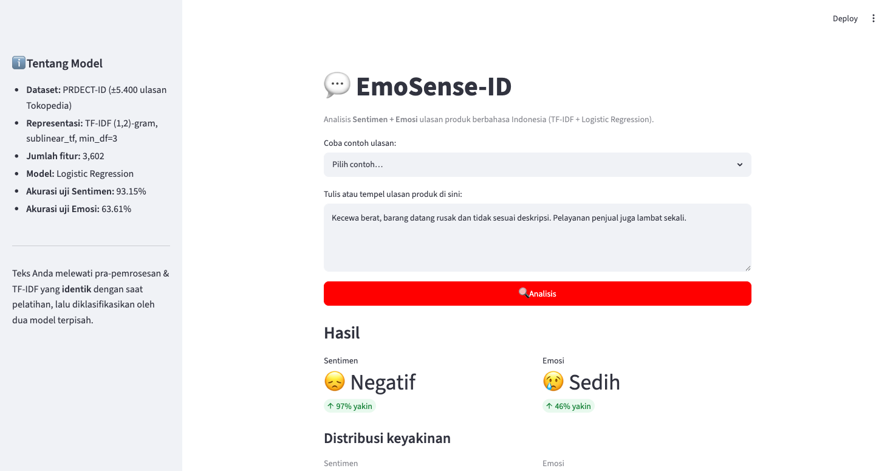

# 💬 EmoSense-ID — Analisis Sentimen, Emosi & Aspek Ulasan Produk Indonesia

Sistem NLP yang menerima teks ulasan produk berbahasa Indonesia, lalu menganalisis:

- **Sentimen** — Positif / Negatif
- **Emosi** — Senang / Sedih / Marah / Takut / Cinta
- **Aspek (ABSA)** — sentimen per-aspek: Pengiriman, Kualitas Produk, Harga, Pelayanan, Kemasan

Inti model dilatih sendiri dengan **TF-IDF + Logistic Regression** (scikit-learn) di atas
dataset **PRDECT-ID**. Di atasnya ada **lapisan AI opsional** (OpenRouter) yang merangkum
hasil + menyusun saran balasan penjual. Sistem disajikan lewat **3 antarmuka** yang berbagi
satu inti: **Streamlit** (web), **FastAPI** (REST API), dan **bot Telegram** (via n8n).

> Proyek UAS mata kuliah Natural Language Processing — Informatika, Primakara University.



## 🌐 Demo Live

| Antarmuka                         | URL                                                                               |
| --------------------------------- | --------------------------------------------------------------------------------- |
| 🖥️ Aplikasi web (Streamlit)       | <https://nlp-streamlit.imadegautama.com>                                          |
| 🔌 REST API (FastAPI)             | <https://nlp-api.imadegautama.com> — coba <https://nlp-api.imadegautama.com/docs> |
| 🤖 n8n (orkestrator bot Telegram) | <https://nlp.imadegautama.com>                                                    |

Ketiganya di-deploy di **Coolify** lewat pipeline CI/CD (lihat [Deployment](#️-deployment-coolify)).

---

## ✨ Fitur Unggulan

1. **Tiga lapis analisis** — Sentimen + Emosi + **Aspect-Based Sentiment Analysis (ABSA)**.
   ABSA memecah ulasan jadi klausa, mendeteksi aspek, lalu menilai sentimen tiap aspek —
   jadi _"barangnya bagus tapi pengiriman lama"_ terbaca: Kualitas = Positif, Pengiriman = Negatif.
2. **Explainability** — menampilkan kata (termasuk bigram seperti `tidak sesuai`)
   yang paling mendorong sebuah prediksi, dihitung dari koefisien model linear.
3. **Penanganan negasi** — kata seperti _tidak, bukan, jangan_ sengaja dipertahankan
   saat pra-pemrosesan agar makna `tidak bagus` tidak terbalik menjadi `bagus`.
4. **Lapisan AI (opsional)** — LLM via OpenRouter merangkum hasil secara natural +
   menyusun **saran balasan penjual**. Jika tanpa API key, sistem inti tetap berjalan normal.
5. **Tiga antarmuka, satu inti** — Streamlit (web), FastAPI (REST API), dan bot Telegram (n8n)
   memakai logika yang sama di `src/`.
6. **Konsistensi train/inference** — teks pengguna melewati pra-pemrosesan & TF-IDF
   yang identik dengan saat pelatihan (satu sumber kode: `src/preprocessing.py`).

---

## 📁 Struktur Proyek

```
uas-nlp/
├── data/
│   └── prdect_id.csv               # dataset (unduh via src/download_data.py)
├── src/
│   ├── download_data.py            # unduh dataset PRDECT-ID
│   ├── preprocessing.py            # clean_text() — dipakai SEMUA antarmuka
│   ├── train.py                    # TF-IDF + bandingkan model + latih + simpan
│   ├── evaluate.py                 # metrik + confusion matrix
│   ├── absa.py                     # Aspect-Based Sentiment Analysis (ABSA)
│   └── llm.py                      # lapisan AI OpenRouter (opsional)
├── models/                         # artefak hasil training (.joblib + metadata)
├── reports/                        # confusion matrix, ringkasan metrik, demo
├── notebooks/
│   ├── 01_eksplorasi_data.ipynb    # EDA (distribusi label, panjang teks)
│   └── 02_pelatihan_model.ipynb    # pelatihan + evaluasi langkah demi langkah
├── app/
│   └── streamlit_app.py            # antarmuka WEB (Streamlit)
├── api.py                          # antarmuka REST API (FastAPI)
├── n8n/
│   └── emosense-bot.workflow.json  # antarmuka BOT Telegram (n8n)
├── docs/
│   └── TELEGRAM_N8N.md             # panduan setup bot Telegram
├── requirements.txt                # dependensi training + Streamlit
├── requirements-api.txt            # dependensi REST API (ringan, tanpa Streamlit)
└── README.md
```

## 🏗️ Arsitektur (3 antarmuka, 1 inti)

```
            ┌──────────── INTI (folder src/) ────────────┐
            │  preprocessing.clean_text                   │
            │  TF-IDF + model Sentimen & Emosi (.joblib)  │
            │  absa.analyze_aspects   (ABSA)              │
            │  llm.analyze            (OpenRouter, opsional)│
            └─────▲────────────▲────────────▲─────────────┘
          Streamlit (web)  FastAPI (api.py)  (LLM dipanggil inti)
          untuk MANUSIA    untuk MESIN/BOT
                                ▲ HTTP POST /analyze
                          n8n + Bot Telegram (CHAT)
```

Logika inti ditulis sekali di `src/` lalu dipakai bersama oleh Streamlit, FastAPI,
dan (lewat FastAPI) bot Telegram.

---

## 📂 Dataset

**PRDECT-ID** (_Indonesian Product Reviews Dataset for Emotions Classification Tasks_) —
±5.400 ulasan produk dari Tokopedia (29 kategori), dianotasi oleh ahli psikologi klinis.
Setiap ulasan memiliki label **Sentiment** (Positive/Negative) dan **Emotion**
(Anger, Fear, Happy, Love, Sadness).

- Sumber: <https://github.com/rhiosutoyo/PRDECT-ID-Indonesian-Product-Reviews-Dataset>
- Publikasi: Sutoyo dkk., _Data in Brief_ (2022). DOI Mendeley: `10.17632/574v66hf2v.1`

**Distribusi label**

| Sentimen | Jumlah |     | Emosi   | Jumlah |
| -------- | ------ | --- | ------- | ------ |
| Negative | 2.821  |     | Happy   | 1.770  |
| Positive | 2.579  |     | Sadness | 1.202  |
|          |        |     | Fear    | 920    |
|          |        |     | Love    | 809    |
|          |        |     | Anger   | 699    |

Sentimen relatif seimbang; emosi tidak seimbang → evaluasi memakai **macro-F1** dan
pelatihan memakai `class_weight='balanced'`.

---

## 🚀 Cara Menjalankan

> Prasyarat: Python 3.11+ (diuji pada 3.13).

```bash
# 1. Buat virtual environment & install dependensi
python3 -m venv .venv
source .venv/bin/activate        # Windows: .venv\Scripts\activate
pip install -r requirements.txt

# 2. Unduh dataset ke data/prdect_id.csv
python src/download_data.py

# 3. Latih model (menghasilkan artefak di models/)
python src/train.py

# 4. Evaluasi (menghasilkan confusion matrix & ringkasan di reports/)
python src/evaluate.py

# 5. Jalankan aplikasi
streamlit run app/streamlit_app.py
```

Aplikasi akan terbuka di <http://localhost:8501>.

> Untuk membuka notebook EDA: `pip install jupyter` lalu
> `jupyter notebook notebooks/01_eksplorasi_data.ipynb`.
>
> Untuk mengaktifkan **fitur AI** (ringkasan + saran balasan), isi API key OpenRouter di
> sidebar Streamlit, atau set `OPENROUTER_API_KEY` sebelum menjalankan.

### Menjalankan REST API (FastAPI)

```bash
pip install -r requirements-api.txt
# tanpa AI:
uvicorn api:app --host 0.0.0.0 --port 8800
# dengan AI:
OPENROUTER_API_KEY="sk-or-..." uvicorn api:app --port 8800
```

Cek: `curl http://localhost:8800/health`. Lihat endpoint di bawah.

### Menjalankan Bot Telegram (n8n)

Import `n8n/emosense-bot.workflow.json` ke n8n, set kredensial Telegram, arahkan node
**Analisis** ke URL API Anda. Panduan lengkap: [`docs/TELEGRAM_N8N.md`](docs/TELEGRAM_N8N.md).

---

## 📊 Hasil Evaluasi (data uji, 1.080 ulasan)

| Tugas        | Accuracy | Macro-F1 |
| ------------ | -------- | -------- |
| **Sentimen** | 0.9380   | 0.9377   |
| **Emosi**    | 0.6361   | 0.6086   |

Perbandingan kandidat model (5-fold CV, macro-F1) yang mendasari pemilihan
**Logistic Regression**:

| Model                   | Sentimen | Emosi      |
| ----------------------- | -------- | ---------- |
| **Logistic Regression** | 0.9402   | **0.5870** |
| Linear SVM              | 0.9433   | 0.5752     |
| Multinomial NB          | 0.9404   | 0.4556     |

Logistic Regression menang pada tugas Emosi (yang lebih sulit) dan setara pada Sentimen,
**sekaligus** menyediakan `predict_proba` (skor keyakinan) dan `coef_` (explainability) —
karena itu dipilih sebagai model final.

### Hyperparameter Tuning (GridSearchCV)

Selain memilih model, hyperparameter di-_tune_ dengan **GridSearchCV** (cv=5, `scoring=f1_macro`)
di atas `Pipeline(TF-IDF → LogReg)` — vectorizer di-refit per-fold (tanpa kebocoran data).

```bash
python src/train.py --tune
```

| Tugas    | Hyperparameter terbaik        | Dampak                       |
| -------- | ----------------------------- | ---------------------------- |
| Sentimen | `C=10`, ngram (1,2), min_df=3 | Accuracy 0.9315 → **0.9380** |
| Emosi    | `C=1`, ngram (1,2), min_df=3  | ≈ tetap (0.6361)             |

Tuning paling membantu Sentimen; Emosi sudah mentok di sekitar batas representasi TF-IDF.
Tanpa flag `--tune`, `train.py` memakai parameter default yang masuk akal.

Confusion matrix tersimpan di `reports/confusion_matrix_sentimen.png` dan
`reports/confusion_matrix_emosi.png`. Ringkasan lengkap: `reports/metrics_summary.md`.

---

## 🧠 Cara Kerja (Pipeline)

```
Teks ulasan
   │
   ▼
clean_text()  ── case folding → hapus URL/angka/simbol → hapus stopword
   │              (negasi dipertahankan) → stemming Sastrawi
   ▼
TfidfVectorizer  ── unigram + bigram, sublinear_tf, min_df=3  → vektor fitur
   │
   ├──► Logistic Regression (Sentimen)  → label + probabilitas
   ├──► Logistic Regression (Emosi)     → label + probabilitas
   │         │
   │         └─► Explainability: nilai TF-IDF × koefisien → kata berpengaruh
   │
   └──► ABSA (src/absa.py): pecah klausa → deteksi aspek (leksikon) →
            jalankan model Sentimen per klausa → sentimen per-aspek
                                            │
                                            ▼
              LLM (src/llm.py, OpenRouter, opsional): ringkasan natural
              + saran balasan penjual  →  ditampilkan / dibalas bot
```

**Penting:** langkah `clean_text()` dan `TfidfVectorizer` yang sama persis dipakai
baik saat pelatihan maupun saat memproses input pengguna di aplikasi. Vectorizer
yang sudah di-`fit` disimpan (`models/tfidf_vectorizer.joblib`) dan dimuat ulang —
**tidak** dilatih ulang.

---

## 🖥️ Dokumentasi Antarmuka

### Aplikasi Streamlit (web)

- **Input:** text area untuk ulasan + dropdown contoh siap-pakai. Sidebar berisi info model
  dan kolom **API key OpenRouter** (mengaktifkan fitur AI).
- **Output:** kartu metrik Sentimen & Emosi + % keyakinan; bar chart distribusi probabilitas;
  tabel **kata paling berpengaruh**; seksi **🧩 Analisis per Aspek (ABSA)**; dan seksi
  **🤖 Analisis AI** (ringkasan + saran balasan, bila key diisi).

### REST API (FastAPI)

| Method & Endpoint | Fungsi                                                                  |
| ----------------- | ----------------------------------------------------------------------- |
| `GET /`           | info layanan + daftar endpoint                                          |
| `GET /health`     | status + daftar kelas + `ai_enabled`                                    |
| `GET /docs`       | dokumentasi interaktif (Swagger UI)                                     |
| `POST /analyze`   | body `{"text":"..."}` → JSON: `sentiment`, `emotion`, `aspects[]`, `ai` |

Contoh:

```bash
curl -X POST https://nlp-api.imadegautama.com/analyze \
  -H "Content-Type: application/json" \
  -d '{"text":"pengiriman cepat tapi barangnya jelek dan harga kemahalan"}'
```

Respons memuat `sentiment.label_id`, `emotion.label_id`, `aspects[]` (aspek + sentimen +
keyakinan + klausa), dan `ai` (`summary` + `suggested_reply`) bila `OPENROUTER_API_KEY` aktif.

---

## 🤖 Lapisan AI (OpenRouter)

LLM **bukan** pengganti model — ia lapisan augmentasi di atas hasil model buatan sendiri.
Setelah model memberi Sentimen + Emosi + ABSA, modul `src/llm.py` mengirim ringkasan itu ke
**OpenRouter** (API LLM, skema OpenAI-compatible) untuk menghasilkan:

1. **Ringkasan natural** berbahasa Indonesia, dan
2. **Saran balasan penjual** yang sopan & solutif.

Detail teknis:

- **Model:** default model gratis (`:free`) dengan **fallback otomatis** antar-model bila kena
  rate-limit (429) — lihat `FALLBACK_MODELS` di `src/llm.py`.
- **Guardrail:** prompt membatasi LLM hanya pada konteks ulasan/produk.
- **Opsional & aman gagal:** tanpa API key, seksi AI tidak muncul; model inti tetap jalan.
- **Konfigurasi `OPENROUTER_API_KEY`** dibaca berurutan: 1. input sidebar Streamlit, 2. `.streamlit/secrets.toml` (gitignored), 3. environment variable. Di Coolify: set sebagai
  **env per-resource** (jangan di-commit).
- Dapatkan key di <https://openrouter.ai/keys>.

---

## 💬 Bot Telegram (n8n)

Antarmuka chat dibangun di **n8n** (workflow: `n8n/emosense-bot.workflow.json`). Alur:

```
User kirim ulasan → Telegram Trigger → (cek /start) → HTTP POST /analyze
   → Format Balasan (Code node) → Kirim Balasan ke Telegram
```

- n8n **tidak** memanggil OpenRouter langsung — ia hanya memanggil `POST /analyze`; lapisan AI
  dijalankan di sisi API. Jadi `OPENROUTER_API_KEY` cukup ada di server API.
- Setelah **import JSON**, hanya perlu 2 setelan manual: **kredensial Telegram** (3 node) dan
  **URL node `Analisis`** (arahkan ke domain API, mis. `https://nlp-api.imadegautama.com/analyze`).
- Panduan lengkap: [`docs/TELEGRAM_N8N.md`](docs/TELEGRAM_N8N.md).

---

## ☁️ Deployment (Coolify)

Sistem ini di-deploy ke **Coolify** dengan pipeline CI/CD: **push ke `main`** → GitHub Actions
build 2 image (API + Streamlit) → **Docker Hub** → trigger redeploy 2 resource Coolify lewat
webhook. n8n berjalan sebagai service Coolify tersendiri.

```
git push main ─▶ GitHub Actions ─┬─ Dockerfile.api ─▶ Docker Hub: emosense-api ─┐
                                 └─ Dockerfile     ─▶ Docker Hub: emosense-streamlit ─┤
                                                                                     ▼
                                                              webhook ─▶ Coolify redeploy
```

| Service   | Domain                           | Port |
| --------- | -------------------------------- | ---- |
| Streamlit | `nlp-streamlit.imadegautama.com` | 8501 |
| REST API  | `nlp-api.imadegautama.com`       | 8800 |
| n8n (bot) | `n8n.imadegautama.com`           | 5678 |

`OPENROUTER_API_KEY` di-set sebagai **environment variable per-resource** di Coolify (bukan
di-bake ke image / di-commit). Karena memakai scikit-learn (bukan TensorFlow), image jalan di
arsitektur apa pun — bebas isu AVX. **Panduan lengkap:** [`docs/COOLIFY_DEPLOY.md`](docs/COOLIFY_DEPLOY.md).

> Alternatif untuk web app saja: Streamlit Community Cloud (baca `requirements.txt`, main file
> `app/streamlit_app.py`) — ringan karena model TF-IDF berukuran kecil.

---

## 📝 Catatan Akademik

Setiap baris kode dapat dijelaskan: TF-IDF, perbedaan Logistic Regression / SVM / Naive
Bayes, metrik precision/recall/F1, pembacaan confusion matrix, alasan menjaga kata negasi,
serta cara **ABSA** memecah klausa & memetakan aspek (berbasis aturan + model). **Inti yang
dinilai = model buatan sendiri**; lapisan LLM (OpenRouter) & bot (n8n) adalah augmentasi/
antarmuka, bukan pengganti model. Proyek ini menekankan **pemahaman**, bukan sekadar menjalankan kode.

Batasan yang jujur disampaikan: ABSA berbasis leksikon bisa meleset pada kata gaul di luar
kosakata (mis. "jutek") → ditandai dengan keyakinan rendah; emosi 5-kelas lebih sulit (≈64%)
dibanding sentimen biner (≈93%).

---

## 📚 Referensi

- Sutoyo, R., dkk. (2022). _PRDECT-ID: Indonesian product reviews dataset for emotions
  classification tasks._ Data in Brief.
- Sastrawi — stemmer Bahasa Indonesia: <https://github.com/har07/PySastrawi>
- scikit-learn: <https://scikit-learn.org> · Streamlit: <https://streamlit.io>
- FastAPI: <https://fastapi.tiangolo.com> · OpenRouter: <https://openrouter.ai>
- n8n (otomasi/orkestrasi): <https://n8n.io> · Coolify (deploy): <https://coolify.io>
