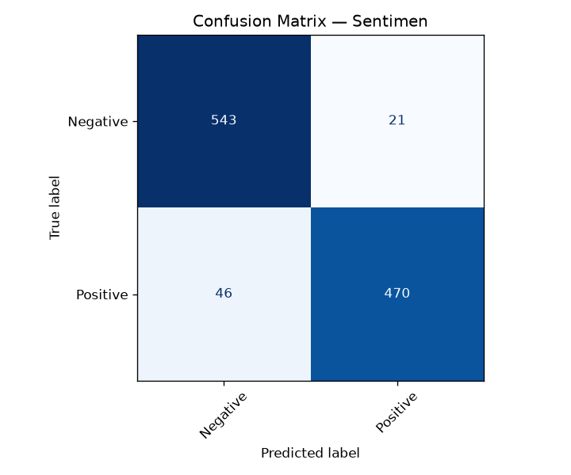
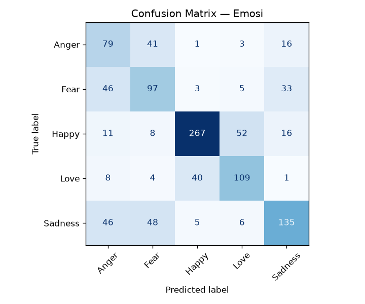

# Ringkasan Evaluasi EmoSense-ID

## Tugas: Sentimen

- **Accuracy**: 0.9380
- **Macro-F1**: 0.9377

```
              precision    recall  f1-score   support

    Negative     0.9219    0.9628    0.9419       564
    Positive     0.9572    0.9109    0.9335       516

    accuracy                         0.9380      1080
   macro avg     0.9396    0.9368    0.9377      1080
weighted avg     0.9388    0.9380    0.9379      1080
```



## Tugas: Emosi

- **Accuracy**: 0.6361
- **Macro-F1**: 0.6086

```
              precision    recall  f1-score   support

       Anger     0.4158    0.5643    0.4788       140
        Fear     0.4899    0.5272    0.5079       184
       Happy     0.8449    0.7542    0.7970       354
        Love     0.6229    0.6728    0.6469       162
     Sadness     0.6716    0.5625    0.6122       240

    accuracy                         0.6361      1080
   macro avg     0.6090    0.6162    0.6086      1080
weighted avg     0.6570    0.6361    0.6429      1080
```


